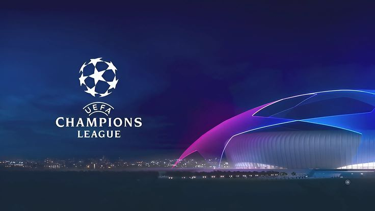

  
  

  

    
    
    
  

  

    <strong>⚽ UEFA Champions League — Real Madrid AI Predictor & Analytics Engine</strong>
  

  

    
    
    
  

  

    
    
    
  

---

## 🖼️ UCL Hola Madridista

  <!-- IMAGE BANNER -->
  

  

    ⚽ Real Madrid UCL Analytics • 2025/26 Season
  

---

---

## 🚀 ChampIntel AI — Masterplan Proyek

Sistem analisis dan pemodelan prediktif UEFA Champions League berbasis microservice, menggabungkan pemrosesan data statistik XGBoost dan narasi analisis LLM Qwen (QLoRA).

### 🏗️ Arsitektur Monorepo
* **`apps/api` (Go + Gin):** Service core backend & API Gateway berkinerja tinggi untuk menangani request client.
* **`apps/ai-service` (Python + FastAPI):** Service inference machine learning (XGBoost, SHAP, Qwen LLM).
* **`apps/web` (Next.js / React):** Web dashboard & UI platform visualisasi statistik.
* **`ml/`:** Pipeline training, pengolahan dataset, serta notebook eksperimen model.
* **`infra/`:** Konfigurasi Docker, Docker Compose, dan deployment.

---

### 📊 Machine Learning Pipeline (XGBoost + SHAP)
* **18 Fitur Terarah:** Mengelompokkan tren performa, formasi, efisiensi gol, dan statistik laga.
* **Dinamika Leg 1 & Leg 2:** Penanganan fase gugur menggunakan akumulasi fitur `aggregate_difference` dan `home/away_aggregate_before`.
* **Explainable AI (XAI):** Penggunaan **SHAP** untuk transparansi kontribusi setiap fitur terhadap probabilitas kemenangan.

---

### 🤖 LLM Reasoning Engine (Qwen + QLoRA)
* **Anti-Hallucination Guardrails:** System prompt terstruktur dengan dataset ramping (100–200 sampel terverifikasi) agar narasi LLM konsisten terhadap data XGBoost & SHAP.
* **Fine-Tuning:** Memakai metode **QLoRA** untuk efisiensi resource GPU tanpa mengorbankan kualitas analisis teknis.

---

### 📈 Metrik Evaluasi Model
* **Probabilitas Pertandingan:** Evaluasi performa model menggunakan **Log Loss** dan **Brier Score**.
* **Kualitas Narasi AI:** Evaluasi keluaran teks LLM menggunakan metrik **Faithfulness** terhadap output statistik.
